# Reactive programming 

## Reactive system 

Any  application should react to changes:

- any changes in demand (load) 
- any changes in the availability of services 

these kinf of  app should be **reactive** to any changes that affects the system ability to response to user request 

Main features of the **reactive**  app : 
- ability to stay responsive under a varying workload
- throughput of the system should increase automatically when more users start using it
- should decrease automatically when the demand goes down. 

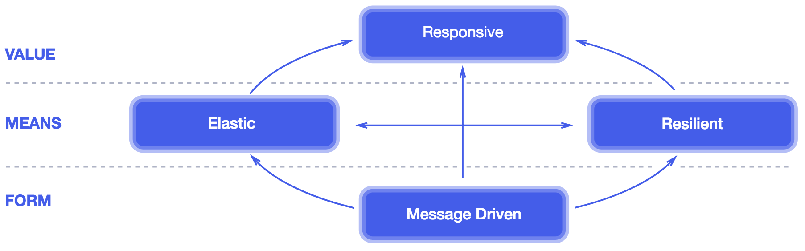
In the interconnected world of microservices one possible 
botleneck could be the blocking communication among microservices with ex 
Spring Boot + Servlet ( less then 3.0)  communication when the incoming request is served by a single dedicated thread. 


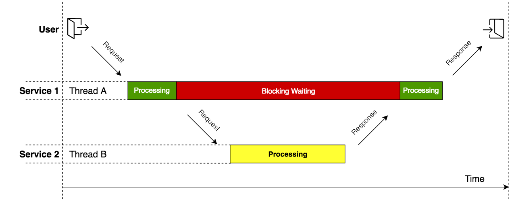


## Reactive Programming ... the first solutions  

### Observer real life situation 

The following design solution is a starting point to design(implement) reactive programming 

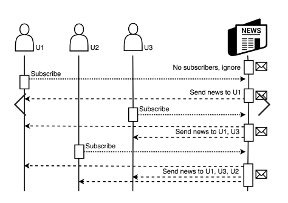 

### Observer design pattern as a solution 

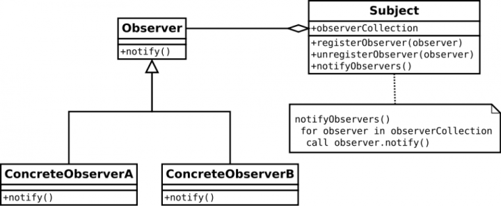 

--- 

## Reactive programming with Rx libraries 


In reactive programming:
 - a 'stream of data' OR a 'stream of event' OR etc.  can be created
 - the (reactive ) app can  listen and react to  the streaming  

 Use Case : Backpressure : One of the big challenge of the IoT is the processing of the huge amount of teh generated data

### Modeling the observable with the `marble` diagram 


### Oberserver? 

  Observers are more hidden ... usually we define some `code` responses to the data(elements) flow generated by Observables 


### Operator 

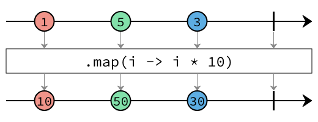


### Use Case with RxJS (version 4.1)  
```bash 
npm install rx --save
```

## Creating Observable 
```JavaScript
Rx.Observable.from(iterable,[mapFunction],[otherFunction],[otherFunction])
```

>> `iterable`:  the iterable object to be converted into an observable (can be an array, set, map, and so on)

>>  `mapFunction`: the function to be called for every element in the array to map it to a different value


### Creating observers/subscribers  

```JavaScript
Observable.subscribe(onNext,onError,onCompleted);
```
>>  `onNext`: This is a function to be called every time new data is propagated through the observable

>>  `onError`: This is a function to be called every time an error occurs in the observable

>>  `onCompleted`: This is a function to be called when the observable is completed


### Examples 

Observable creation with `from`
 -  


Observable creation with `event`
 -  
 -  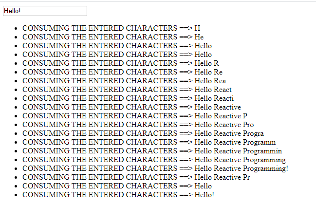


### Reactive solution with Rx java libraries 

Reactive solution main building blocks: Observer + Iterator design pattern implemented in
- RxJava 1.X
- RxJava 2.x 

The Rx solutions not fully  solved the `backpressure` issue: Rx implemented just the `pull` principle.  

--- 

## Reactive Stream spec 

The Reactive Streams **specification** defines the following  interfaces: 

- `Publisher<T>` ( start point of the communication)
- `Subscriber<T>` (end point of the communication), 
- `Subscription` (handle the  start - end points relation), 
- and `Processor <T, R>`  (some transformation logic).

by introducing the  *pull-push*  data exchange model resolves  the *backpressure* issue. 

 

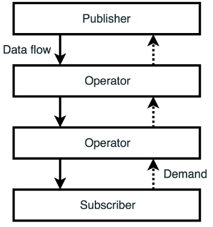


## Projector Reactor as implementation of the Reactive Stream Spec

- Project Reactor 1.x 
- Project Reactor 2.x   

Adding Reactor to the Spring (5.x) project

```Groovy 
compile("io.projectreactor:reactor-core:3.2.0.RELEASE")
//...
testCompile("io.projectreactor:reactor-test:3.2.0.RELEASE")  
```
Reactive types – Flux and Mono as `Publisher<T>` implementation 

- `Flux`  defines a reactive stream that can produce zero, one, or many elements


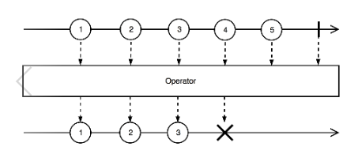

Flux stream transformed into another Flux stream


 `Mono`  defines a reactive stream that can produce zero, or one element
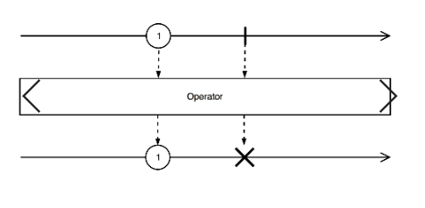

Example of Reactive Flux streams 
```Java
Flux<String>  stream1 = Flux.just("Hello","world");
Flux<Integer> stream2 = Flux.fromArray(newInteger[]{1,2,3});
Flux<Integer> stream3 = Flux.fromIterable(Arrays.asList(9, 8, 7));
//....
Flux<Integer> stream4 = Flux.range(2019, 9); // starting with 2019 generate 9 elements 
```

Example of Reactive Mono streams 
```Java
Mono<String> stream5 = Mono.just("One");
Mono<String> stream6 = Mono.justOrEmpty(null);
Mono<String> stream7 = Mono.justOrEmpty(Optional.empty());
//...
Mono<String> stream8 = Mono.fromCallable(()->httpRequest()); // handling a asynchronous requests http|db  
// shorthener way 
Mono<String> stream8 = Mono.fromCallable(this::httpRequest);
```

Use cases with different `subscribe` functions.   

```Java
Flux.just("A","B","C")
  .subscribe(
        data -> log.info("onNext: {}", data),
        err ->{ /* ignored  */ },
        ()-> log.info("onComplete")
      );
```

```Java
  Flux.range(1, 100)
                .subscribe(
                        data -> log.info("onNext: {}", data),
                        err -> { /* ignore */ },
                        () -> log.info("onComplete"),
                        subscription -> {
                            subscription.request(4);
                            //subscription.cancel();
                            log.info("Request end for 4 ");
                            subscription.request(4);
                        }
                );
```
---

## Reactive Spring 

### Spring as "classic"  

Main concept are the 
 - Servlet Container 
 - Servlet 


Servlet Container for ex. is the embedded Jetty/Tomcat/etc. webserver

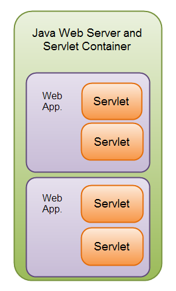

### Reactive Sping with Netty 


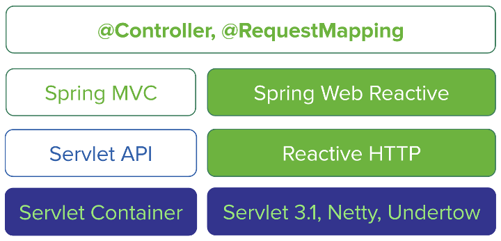 


Netty:

  - asynchronous
  - event-driven 
  - network 

based `application framework` for network intesnsive IO applications.  


Uses a single thread concurrency models and designed around non-blocking IO


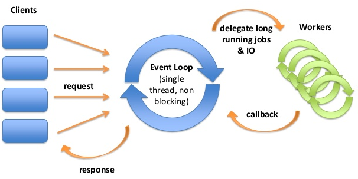 


The main buildig blocks in actions:


### The core features are : 

- handle the backpressure 
`backpressure` is a mechanism that permits a receiver to ask how much dat it wants to receive from the emitter.
- implements the push-pull strategy|model 
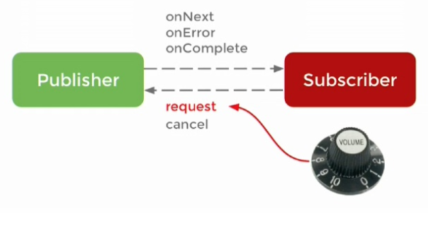 
- reactive `stream` based controllers , and alternatives to different handler design 
- functional programming (lambda oriented routing, processing)
- non-blocking: make asynchronous calls and respond as the results of those calls are returned


### Initializing Spring with reactive  features  (Use Case) 

- Web -> Reactive Web (Includes Spring WebFlux)
- NoSQL  -> Reactive MongoDB  (includes the drivers)
- NoSQL  -> Embedded MongoDB (run embedded version of MongoDB)
- Core -> Lombok (special annotation will generate getters, setters. etc...)

Application dependencies (starters)

```groovy 
dependencies {
	compile('org.springframework.boot:spring-boot-starter-data-mongodb-reactive')
	compile('org.springframework.boot:spring-boot-starter-webflux')
	compile('org.projectlombok:lombok')
	compile('de.flapdoodle.embed:de.flapdoodle.embed.mongo')
	runtime('org.springframework.boot:spring-boot-devtools')
	testCompile('org.springframework.boot:spring-boot-starter-test')
	testCompile('io.projectreactor:reactor-test')
}
```
 
 
### (Webflux) application main elements 

- DeliveryModel  - define the model returned by the repository 
- DeliveryRepository - define the interface of the repository, to persist to and from the DB (reactive DB!!!)
- DeliveryService (Interface and Implementation) -  implement the service logic (interact with the repository)
- DeliveryController - receives the requests and return reactive responses (Mono and FLuxes)


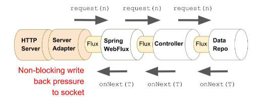  

### Important notes regarding the DB 

```Java
@EnableReactiveMongoRepositories
@SpringBootApplication
public class AnnotationdemoApplication {

	public static void main(String[] args) {
		SpringApplication.run(AnnotationdemoApplication.class, args);
	}

}
```


## Functional reactive services with Spring WebFlux

Functional Spring WebFlux application is based on 
- a router  responsible for routing HTTP requests to handler functions.
- handler functions are responsible for executing business functionality and building responses.

In the handler functions 
- The handler functions return Mono<ServerResponse>. 
- each method is passed a `ServerRequest` argument
- the `ok()` method returns a `BodyBuilder` with an HTTP status code of 200; 
- the `body()` method sets the contents to be returned to the caller and returns a `Mono<ServerResponse>`.
 
